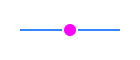
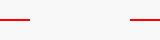
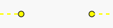

# 地物スタイルまとめ

本ファイルでは、時空地図アプリケーションにおける地物の表示スタイルを状態別に整理し、
改善点を検討します。情報は `RenderStyleProvider.js` と `MapViewRendererHelper.js` に
定義された内容を基にしています。

## 1. 基本表示 (RenderStyleProvider.js)

以下のパラメーターでカテゴリ別にスタイルが定義されています。

| 地物 | 主なプロパティ | 図例 |
|------|----------------|------|
| 点   | `radius`, `fill`, `stroke`, `strokeWidth`, `textColor` | `●` |
| 線   | `stroke`, `strokeWidth`, `strokeDasharray`, `textColor` | `o─o` |
| 面   | `fill`, `fillOpacity`, `stroke`, `strokeWidth`, `textColor` | `□` |

```
● 点
o─o 線
+----+
|    |  面
+----+
```
*図1 : 点・線・面の基本表示イメージ*

カテゴリ例として `city` は半径5で赤塗り、`kingdom` は半透明の赤塗りに赤い外枠を持ちます。

## 2. 編集時の状態 (MapViewRendererHelper.js)

### 2.1 選択状態

| 部位 | スタイル例 |
|------|------------|
| 通常頂点マーカー | 半径3、塗り `rgba(0,150,255,0.5)`、枠 `rgba(0,100,200,0.7)` |
| 選択地物外枠 | `stroke: #00ffff`、`strokeWidth: 4`、破線 `4,4` |
| 選択頂点 | 半径6、塗り `#00ffff`、枠 `#0000ff` 幅2 |
| 関連地物ハイライト | `stroke: #0088aa`、`strokeWidth: 2`、破線 `2,2` |

### 2.2 ドラッグ中

| 部位 | スタイル例 |
|------|------------|
| ドラッグ頂点 | 半径7、塗り `#ff00ff`、枠 `#ffffff` 幅2 |
| 仮アウトライン | `stroke: #ff00ff`、`strokeWidth: 2`、破線 `3,3` |

### 2.3 追加プレビュー

| 部位 | スタイル例 |
|------|------------|
| 追加点プレビュー | 半径6、塗り `#ff0000`、枠 `#ffffff` 幅2（点ツール時） |
| 接続線プレビュー | ツールにより色分け (`#0000ff` など)、`strokeWidth: 3`、破線 `5,5` |
| 中間点マーカー | 半径4、塗り `#ffffff`、枠 `#000000` 幅1 |

### 2.4 測定モード

| 部位 | スタイル例 |
|------|------------|
| 測定点 | 半径4、塗り `#ffff00`、枠 `#000000` 幅1 |
| 測定線 | `stroke: #ffff00`、`strokeWidth: 2`、破線 `5,5` |
| ラベル | 黒文字・小さめのフォントサイズ (9〜10) |

### 2.5 その他一時要素

ViewModel から任意に追加される一時要素が存在し、用途によりスタイルは様々です。

### 2.6 表示ロジック上の課題

コード上では `MapViewRendererHelper.renderSelection` が選択地物や選択頂点の情報を
基に頂点マーカーを描画しています【F:src/presentation/views/map/MapViewRendererHelper.js†L44-L166】。
しかし頂点追加ツールを利用する `MapViewEventHandler` の処理では
`EditingViewModel.addVertexToEdge` を実行後に新規頂点だけをドラッグ対象として開始
するだけで【F:src/presentation/views/map/MapViewEventHandler.js†L120-L148】、
`MapViewModel` 側の選択状態は更新されません。
そのため頂点追加モードに入ると既存頂点のマーカーが描かれず、地物全体の形状が把握しづらくなります。
地物自体は描画されたままですが、頂点マーカーが消えるため細部を確認できません。

また新規地物を追加する通常の "add" モードでも
`renderAddingFeaturePreview` は追加中の点や線のみを描画し【F:src/presentation/views/map/MapViewRendererHelper.js†L248-L304】、
既存地物の頂点は示されません。周囲の形状を参照しながら作図しにくい点がユーザビリティ上の課題となっています。

### 2.7 既知の表示不具合

- 頂点追加モード中に既存頂点のマーカーが非表示になる 
- 追加プレビューや距離測定が世界端をまたぐと線が途切れる可能性がある
  (自動スクロールの影響で再現しづらいが、コード上はオフセット描画を行っていない)
   
- ズーム時に点や線幅が固定で拡大縮小に追従しない
- 測定モードのラベルが小さく重なりやすい

#### 2.7.1 不具合について
- 世界端をまたいだ場合については自動スクロールで完全に隠蔽できるので、修正対象外とする。
- ズーム時に点や線幅が追従しないのは仕様。細かい編集をしやすくする意図。
- 測定モードは同時に大圏コースを描画するようにする変更を行う必要がある。

## 3. 改善案

### 3.1 ユーザビリティ向上

- 頂点をやや大きめにし、クリックしやすさを確保する（高解像度環境では半径6では小さい）
- 選択色とハイライト色を明確に区別し、操作対象を判断しやすくする
- 追加プレビュー線の色をツールごとに固定して学習コストを下げる
- ズームレベルに応じて線幅や点サイズを自動調整し、視認性を保つ

### 3.2 一貫性向上

- スタイル定義を一箇所に集約し、複数モジュールで同じ値を共有する
- 破線パターンやフォントサイズを統一し、画面全体の印象を揃える
- ハードコードされた色を減らし、テーマや設定から変更できるようにする

以上を踏まえてスタイルを整理・再設計することで、ユーザビリティと一貫性の向上が期待できます。
