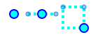
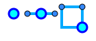
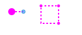

# スタイル改善計画

次の表と図では、現状のデザインと提案する新デザインを比較します。各状態における点・線・面の描画例を図示し、改善の方向性をまとめます。

## 1. 基本表示

| 状態 | 現状図 | 新デザイン図 |
|------|-------|---------------|
| 点   | `●`| `●` (視認性向上のため少し大きめ)|
| 線   | `──`| `──` (ズームに応じて幅調整)|
| 面   | `▒`| `█` (塗りと枠を明確化)|

```
 現状:  ●──●  ▒▒
 新規:  ●──●  ██
```
*図1: 基本表示の比較*

現状 | 改善案
----|----
 | 

## 2. 選択状態

| 部位 | 現状スタイル | 新デザイン案 |
|------|-------------|--------------|
| 選択頂点 | `●` シアン塗り | `●` 青塗り枠太め |
| 選択枠   | 破線 `- -` | 実線 `──` + 色分け |

```
 現状: [●]---
 新規: [●]===
```
*図2: 選択状態の比較*

現状 | 改善案
----|----
 | 

## 3. ドラッグ・追加プレビュー

| 状態 | 現状図 | 改善図 |
|------|-------|-------|
| ドラッグ中 | `●..` | `●==` (色を統一) |
| 追加点     | `○` | `●` (確定前でも濃い色) |

```
 現状: ●.. ○
 新規: ●== ●
```
*図3: 編集中の比較*

現状 | 改善案
----|----
 | 

## 4. 測定モード

| 部位 | 現状スタイル | 新デザイン案 |
|------|-------------|--------------|
| 測定点 | `+` 黄色 | `●` 黄塗り枠黒 |
| 測定線 | 破線 `- -` 黄 | 実線 `──` 黄 + ラベル強調 |

```
 現状: +- -+
 新規: ●==● (距離表示)
```
*図4: 測定モードの比較*

現状 | 改善案
----|----
 | 

## 5. 改善方針

### 5.1 ユーザビリティ

- 頂点サイズを大きめにし、選択しやすくする
- ズームレベルで点と線の太さを自動調整
- 一時要素は淡色ではなく鮮やかな色で区別

### 5.2 一貫性

- すべての状態を `RenderStyleProvider` に集約
- 色や破線パターンを地図全体で統一
- ラベルフォントを固定し、情報の可読性を上げる

以上の改善により、地図編集時の視認性と操作感が向上し、一貫性も保たれます。
